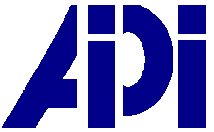

# Codificare, Analizzare, Diffondere: <br />Le *Digital Humanities* nei progetti dottorali

### Benvenuta/o!
Qui troverai tutte le informazioni relative alla scuola estiva CAD 2019. 


### <a name="menu"></a>Menù 
<!--using <a> anchor in header to work-around grave accent issue in markdown anchor-->

* [Introduzione](#introduzione)
* [Informazioni organizzative](#informazioni-organizzative)
* [Requisiti](#requisiti)
* [Iscrizioni](#iscrizioni)
* [Borse di studio](#borse-di-studio)
* [Programma](#programma)
* [Contattaci](#contattaci)
* [Ringraziamenti](#ringraziamenti)

<!--* [Materiali](#materiali)
* [Approfondimento](#approfondimento)
* [Feedback](#feedback) -->

* * * 


## Introduzione

L’uso dell’**informatica nelle ricerche umanistiche** è oggigiorno sempre più importante e si presenta come un dibattito attuale e cruciale nell’**innovazione scientifica**. Si assiste infatti ogni anno alla crescita del numero di specialisti e ricercatori che decidono di impegnarsi nell’uso degli **strumenti digitali** nelle loro ricerche **linguistiche, letterarie, storiche, geografiche** ecc.
Considerando l’estrema attualità di questi strumenti e l’ottima **integrazione** che dimostrano con le metodologie d’analisi tipiche delle discipline umanistiche, pare opportuno prevedere una formazione specifica per **dottorandi in italianistica** che non abbiano ancora avuto l’opportunità di conoscere le **potenzialità** dell’informatica e l’**impatto** che potrebbe avere sui loro progetti di tesi. 

La filosofia di questa scuola è mettere al centro il **testo**, secondo la filosofia tipica delle Digital Humanities: **Codificare, Analizzare e Diffondere**.

In questi quattro giorni si vogliono fornire ai partecipanti un **panorama bibliografico**, degli **strumenti pratici** e delle **indicazioni per la formazione**, da consultare in seguito, per approfondire le competenze utili ad ognuno, con una coscienza critica di cosa è necessario per fare cosa. ll **principale scopo** della formazione proposta è **domandare direttamente ai dottorandi cosa fanno, per suggerire cosa potrebbero fare**. 

### Pubblico

La scuola si rivolge ai **dottorandi di tutti i campi di studio legati all’italianistica**. Si considera un **numero massimo di 20 persone**, quattro per ogni formatore. La lingua della scuola è l’italiano, ma alcuni materiali, esercizi o interventi possono essere in lingua inglese.

### I formatori

I formatori sono giovani ricercatori di livello post-doc, specialisti in studi linguistico-letterari di diversi periodi: studi classici, medievali, moderni e contemporanei. È prevista inoltre la partecipazione della Prof.ssa Elena Pierazzo (Université Grenoble Alpes) e del Prof. Fabio Ciotti (Università di Roma Tor Vergata, presidente AIUCD). Le competenze dei formatori, abbinate alle conoscenze di Informatica Umanistica, li renderanno capaci di seguire gruppi con progetti molto differenti, declinando gli strumenti digitali all’interno delle metodologie d’analisi specifiche e necessarie per i testi di ogni periodo.


<table style="border: none">
	<tr>
		<th>Formatore</th>
		<th>Progett* attual*</th>
	</tr>
    <tr>
        <td>Giovanni Pietro Vitali</td>
        <td><a href="http://www.ultimelettere.it/LastLetters/" target="_blank" title="Opens in new tab">Last Letters</a></td>
    </tr>
    <tr>
    	<td>Greta Franzini</td>
    	<td><a href="https://lila-erc.eu/" target="_blank" title="Opens in new tab">Linking Latin (LiLa)</a> e <a href="https://dig-ed-cat.acdh.oeaw.ac.at/" target="_blank" title="Opens in new tab">Catalogue of Digital Editions</a></td>
	</tr>
	<tr>
    	<td>Simon Gabay</td>
    	<td>AGGIUNGERE</td>
	</tr>
    <tr>
    	<td>Elena Spadini</td>
    	<td><a href="https://www.unil.ch/crlr/home/menuinst/projets-de-recherche/gustave-roud-oeuvres-completes.html" target="_blank">Gustave Roud « Œuvres complètes »</a>, <a href="http://boccacciocommedia.unil.ch" target="_blank">La <i>Commedia</i> di Boccaccio</a></td>
    </tr>
    <tr>
    	<td>Simone Rebora</td>
    	<td>AGGIUNGERE</td>
    </tr>
    
</table>


### Comitato organizzativo 

* **Dott. Giovanni Pietro Vitali** – University College Cork
* **Dott.ssa Greta Franzini** – Università Cattolica del Sacro Cuore
* **Dott. Simon Gabay** – Université de Neuchâtel
* **Dott.ssa Elena Spadini** - Université de Lausanne
* **Dott. Simone Rebora** – Università di Verona
* **Dott. Stefano Bazzaco** - Università di Verona

### Comitato scientifico

* **Prof. Anna Bognolo** - Università di Verona
* **Prof. Adele Cipolla** - Università di Verona
* **Prof. Elena Pierazzo** - Université Grenoble Alpes
* **Prof. Fabio Ciotti** - Università di Roma Tor Vergata


## Informazioni organizzative

<dl>
<dt>Data</dt>
<dd>16-19 luglio 2019</dd>
<dt>Luogo</dt>
<dd>Università di Verona, <a href="http://comunicazione.univr.it/santamarta/index.html" target="_blank" title="Opens in new tab">Polo Santa Marta</a></dd>
<dt>Locandina pubblicitaria</dt>
<dd><a href="https://raw.githubusercontent.com/CADottorato/sito/master/assets/img/CAD-Locandina.jpg" target="_blank" title="Opens in new tab">Download</a> (318 KB)</dd>
<dt>Social</dt>
<dd>Segui la nostra <a href="https://bit.ly/2P0CikQ" target="_blank" title="Opens in new tab">pagina Facebook</a> e/o l'hashtag Twitter #cadottorato19</dd>
</dl>

<!--
<dt>Aule</dt>
<dd>....</dd>
<dt>Cena sociale</dt>
<dd>Ristorante ...</dd>-->


## Requisiti

Non sono richieste competenze computazionali. I partecipanti potranno usare i computer messi a disposizione dall'Università di Verona o lavorare sui propri. Nel secondo caso, andranno installati alcuni programmi prima della Summer School, e saranno fornite istruzioni per l'installazione. 
Conoscenza della lingua inglese. La lingua della scuola è l’italiano, ma alcuni materiali, esercizi o interventi possono essere in inglese.


## Iscrizioni

*Attenzione!* La registrazione non è una conferma di iscrizione. I dossier saranno valutati e tutti coloro che hanno completato la registrazione riceveranno una conferma di accettazione o ricusa entro febbraio 2019. I criteri per la valutazione sono la completezza del dossier e la varietà delle provenienze (saranno privilegiati candidati di diverse università rispetto a più candidati della stessa università); il progetto di tesi in sé non è sottoposto ad alcuna valutazione. La selezione è volta ad assicurare che il numero dei partecipanti non superi il limite di 20, a discapito della qualità della formazione.


#### Come iscriversi

Scarica il formulario per l'iscrizione **[QUI](assets/iscrizioni_form.rtf)**. **I partecipanti dovranno sottoscrivere l’iscrizione all’associazione AIPI per un costo di 50,00€**, che sarà valida fino al 2021 e permetterà quindi la partecipazione al convegno AIPI previsto nel 2020.

La richiesta di iscrizione deve contenere un dossier con:

* una breve presentazione della tesi di dottorato, che ne evidenzi obiettivi di ricerca e metodologia (max 600 parole);
* una breve presentazione su come si pensa usare le Digital Humanities nel proprio progetto di ricerca, corredata da tre domande di ricerca (max 400 parole);
* (opzionale) se già disponibile, un dataset che che si vuole trattare con metodi digitali.

Formulario e dossier devono essere inviati in un **unico file** all'indirizzo **cadottorato@gmail.com**. Formati accettati sono `.rtf`, `.odt`, `.docx`, `.pdf`.

**INFORMAZIONI IMPORTANTI.**<br />
Il **nome** del file deve essere `dossier_CognomeNome`, ad esempio `dossier_RossiMario`.

L'eventuale **dataset** deve essere inviato a parte e può essere composto da file (NO `.pdf`; SI `.txt`, `.xml`, `.odt`, `.docx`, `.rtf`, `.ttl`, `.sql`, ecc.) contenenti testi, date, luoghi, immagini, ecc. Più il dataset è ordinato e strutturato, meno preparazione richiederà per essere trattato. Il dataset può essere composto da un unico file o da più file riuniti in una cartella `.zip`. Il file o la cartella `.zip` deve chiamarsi `dataset_CognomeNome`, ad esempio `dataset_VerdiMaria`.


## Borse di studio

Saranno disponibili 8-10 borse di studio per sostenere le spese di viaggio. LINK ALLA CALL.


## Programma

### Martedì 16 luglio

| Ore          | Sessione          | 
|:-------------|:------------------|
| 10:00-10:30  | Accoglienza       |
| 10:30-11:00  | Benvenuto, presentazione programma, divisione in gruppi |
| 11:30-12:00  | Presentazione progetti di tesi, parte 1 |
| 12:30-13:30  | Pranzo |
| 13:30-15:00  | Presentazione progetti di tesi, parte 2 |
| 15:00-15:30  | Pausa |
| 15:30-17:00  | Keynote: Prof. Elena Pierazzo (UniGrenoble) |
| 17:00-17:30  | Pausa |
| 17:30-18:30  | Controllo computer portatili |
| 18:30-...    | Aperitivo |


### Mercoledì 17 luglio - *Codificare*


| Ore         | Sessione        |
|:------------|:----------------|
| 9:30-10:30  | Software OCR    |
| 10:30-11:00 | Pausa |
| 11:30-12:00 | Edizioni digitali in XML-TEI, parte 1 |
| 12:30-13:30 | Pranzo |
| 13:30-15:00 | Edizioni digitali in XML-TEI, parte 2 |
| 15:00-15:30 | Pausa |
| 15:30-17:00 | Lavoro pratico sulle tesi |
| 17:00-17:30 | Pausa |
| 17:30-18:30 | Sportello individuale (facoltativo) |


### Giovedì 18 luglio - *Analizzare*

| Ore        | Sessione          |
|:-----------|:------------------|
| 9:30-12:30 | Stilometria o NLP |
| 12:30-13:30| Pranzo |
| 13:30-17:00| Lavoro pratico sulla tesi |
| 17:00-17:30| Pausa |
| 17:30-18:30| Sportello individuale (facoltativo) |
| 20:00-...  | Cena sociale |


### Venerdì 19 luglio - *Diffondere*

| Ore        | Sessione        |
|:-----------|:----------------|
| 9:30-12:30 | Pubblicazione web o cartografia digitale |
| 12:20-13:30| Pranzo |
| 13:30-15:00| Lavoro pratico sulle tesi |
| 15:00-15:30| Pausa |
| 15:30-17:00| Keynote: Prof. Fabio Ciotti (Roma Tor Vergata) |
| 17:00-17:30| Pausa |
| 17:30-18:30| Partenza partecipanti | 

<!--## Materiali


### Segnala problemi 

Per segnalare problemi o la presenza di refusi nei materiali didattici, crea un nuovo *issue* [QUI](https://github.com/CADottorato/materiali/issues).


## Approfondimento

* GitHub
* Stilometria
* Ecc.

## Feedback

Come valuteresti la tua esperienza a CAD?
Aiutaci a migliorare scrivendo a ....-->


## Contattaci

Per qualsiasi dubbio, problema, domanda, scrivici al seguente indirizzo: **cadottorato@gmail.com**


## Ringraziamenti

Si ringraziano l'[AIPI](http://www.infoaipi.org/siena.asp) e l'[AIUCD](http://www.aiucd.it/) per il sostegno finanziario e il contributo alla summer school!

<br /><br />
### [Torna al men&#249; &uarr;](#menu)


* * *

<p align="center">
  <a href="http://www.aiucd.it" target="_blank" title="Opens in new tab"></a> &nbsp;&nbsp;&nbsp;&nbsp;
  <a href="http://www.infoaipi.org/" target="_blank" title="Opens in new tab"></a> 
</p>


<a href="https://www.univr.it/en/home" target="_blank" title="Opens in new tab"></a>

<!--

Text can be ~~strikethrough~~.

[Link to another page](./another-page.html).


```js
// Javascript code with syntax highlighting.
var fun = function lang(l) {
  dateformat.i18n = require('./lang/' + l)
  return true;
}
```

```ruby
# Ruby code with syntax highlighting
GitHubPages::Dependencies.gems.each do |gem, version|
  s.add_dependency(gem, "= #{version}")
end
```-->
