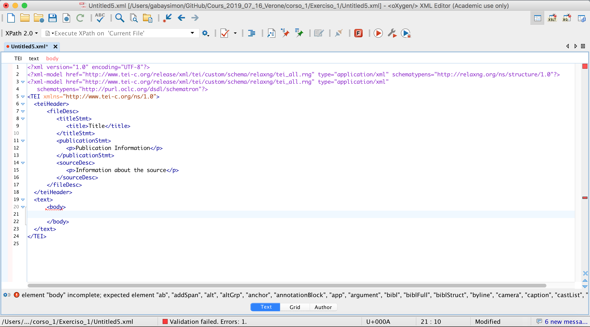
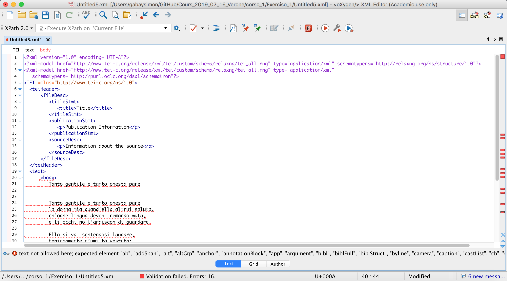
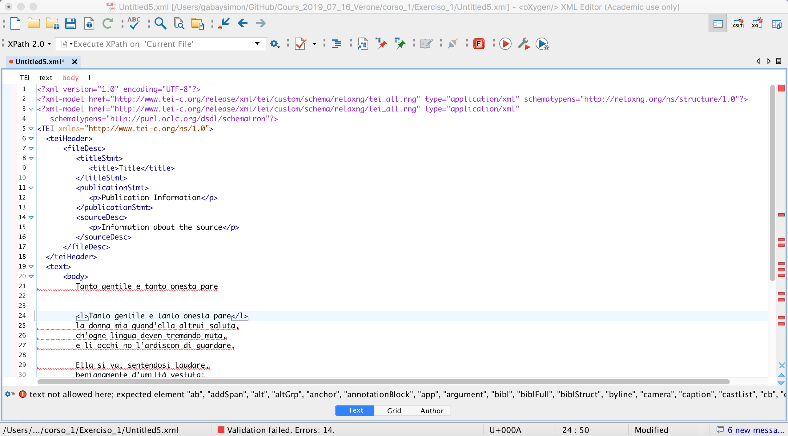
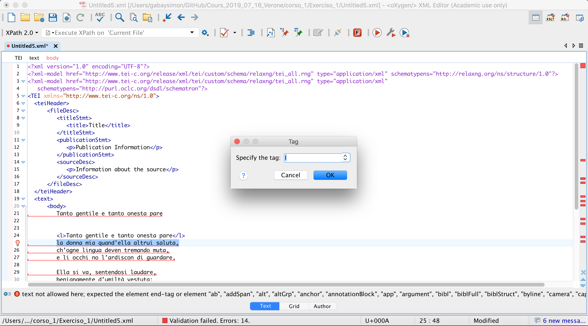

Scuola estiva CADottorato

# Esercizio 1

Simon Gabay
Verona, 17 luglio 2019

---
## Oxyxen
---

### Crea un nuovo documento…


---
### …in XML-TEI


---
### Per ora, lavoreremo solo nel ```<body>```


---
### Rimuovi il elemento ```<p>```: cosa succede?


---
### Apri i caporali : cosa succede?


---
## Esercizio

---
### Copia il testo


---

Cosa vedi? Come si analizza formalmente il testo?

---
### Codifica il primo verso con ```<l>```


---
### Puoi accelerare il lavoro selezionando l'intero verso e premendo ```cmd + E``` (mac) o ```ctrl + E``` (windows)


---
### Usa questi elementi
- Codifica i versi con ```<l>``` (_line_)
- Codifica il titolo con ```<head>```
- Codifica le stanze con ```<lg>``` (_line group_)

### Usa questi attributi
- ```@n``` per numerare i versi del sonetto (```<l n="1">```)
- ```@type``` per specificare il tipo di stanza (```<lg n="quartina">```)
