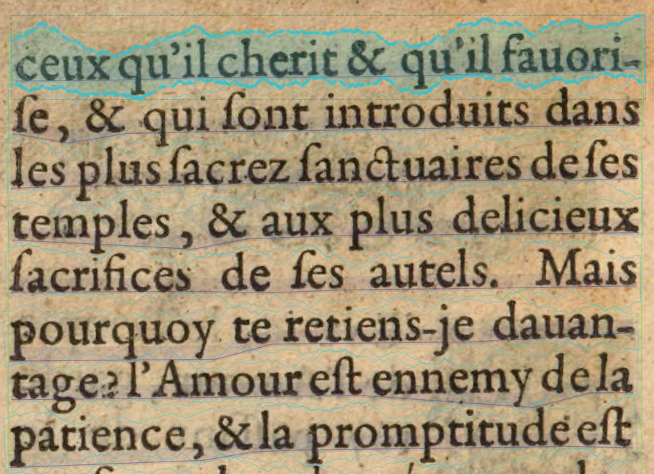

Scuola estiva CADottorato

# Workflow

Simon Gabay
Verona, 16 luglio 2019

---
### OCR

---
### TEI

---
### Riutilizzazione dei dati

Sito [Dramacode](http://dramacode.github.io/) 

---
### XSLT

---
### Testo pulito

---
### Stylometria

---
### Network analysis

---
### Testo pulito

---
### Trattamento automatico del Linguaggio

---
### Analisi dell'annotazione

---
### Georeferenziazione

---
### R

---
### Mappa

---
### Racine vs Scarron

